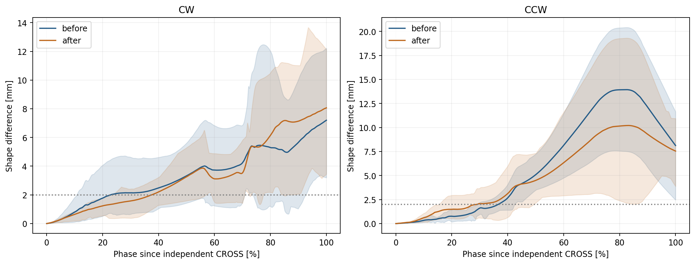
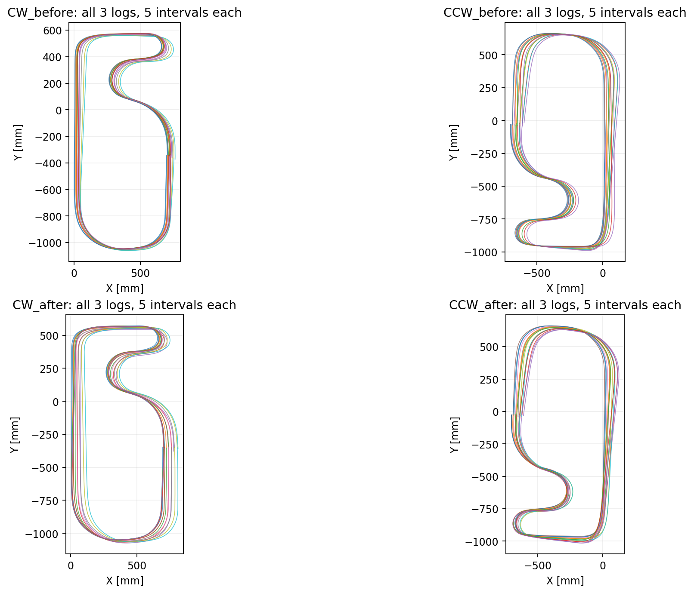

# 走行前IMU校正の待機・取得時間変更 — 12857～12862

2026-10-03。CW12857～12859、CCW12860～12862。比較元は同じ0.5 m/s設定のCW12854～12856、CCW12850～12852。ファームウェアの変更・書き込みはこの解析では行っていない。

## 校正条件

ユーザー申告: カウントダウン7秒、残り5秒で校正開始、5秒間で100サンプル。押下後の約2秒を振動収束の待機に充てる。

現行コードもcontrol.cのcountdown=7000、countdown==5000でIMU_StartCalibration、IMU.hの100サンプル/50 msに一致する。温度は5有効IMUサンプルごとに取得するので、正常時は250 ms間隔で20回。校正終了とcountdown=0等の条件を満たすまで走行を開始しない。コメントには旧3秒/20 msの記載が残るが、今回ユーザーのコードは変更していない。

新規6ログは全てIMU校正100回・エラー0、温度20回・エラー0、校正有効。実際の取得開始時刻・間隔・押下時の静止振動は走行ログに記録されていないため、ログだけから5秒の取得時間や振動収束を実測確認したわけではない。コード設定・申告・ログのサンプル数の整合を確認した。

## Xドリフトの結果

**待機・校正時間の変更後もX+方向のドリフトは残った。CWはばらつきが大きく、CCWは3本とも同程度のずれを残す。押下振動が主因だったとは確認できない。**

| 方向 | 条件 | CSV X [mm/周] | 生エンコーダ＋台形gyro X [mm/周] | 一周±360°との差 [deg/周] |
| --- | --- | ---: | ---: | ---: |
| CW | 変更前 | +10.8 | +9.2 | +0.218 |
| CW | 変更後 | +13.5 | +12.2 | +0.176 |
| CCW | 変更前 | +19.4 | +18.6 | +0.599 |
| CCW | 変更後 | +17.5 | +16.5 | +1.070 |

各群3ログ。1周は独立に検出したCROSSから次のCROSSまでで、各ログ5完全区間を平均。CW平均は12859の小さなずれを含むので個別値も必要。実際の同じコース地点を基準とし、推定座標の平行移動を残して計算する。

| ログ | 方向 | CSV X [mm/周] | 生積分 X [mm/周] | 一周角度差 [deg/周] | 電圧 [V] | 校正平均温度 → 終了温度 [°C] |
| --- | --- | ---: | ---: | ---: | ---: | --- |
| 12857 | CW | +17.7 | +15.9 | +0.151 | 8.31 | 25.375 → 31.125 |
| 12858 | CW | +20.2 | +20.1 | -0.029 | 8.26 | 32.381 → 33.750 |
| 12859 | CW | +2.6 | +0.7 | +0.406 | 8.22 | 34.469 → 34.875 |
| 12860 | CCW | +18.7 | +18.5 | +1.218 | 8.18 | 27.281 → 32.375 |
| 12861 | CCW | +16.6 | +15.5 | +0.614 | 8.13 | 33.269 → 34.625 |
| 12862 | CCW | +17.2 | +15.5 | +1.377 | 8.08 | 30.438 → 34.250 |

12859の生積分Xは約+0.66 mm/周と小さい一方、12857/12858では+15.9/+20.1 mm/周。12859だけを校正変更の効果と扱わない。12858は一周総角度差が約-0.029°でもX+20.1 mm/周残り、一周総角度差だけではXドリフトを説明できない。途中の角度誤差分布や横方向の変位欠落も調べる必要がある。

## 周回途中の形状差

各周の開始位置と開始推定角度をそろえ、最初の完全CROSS間区間と後続4区間を正規化距離1001点で比較。XY差の大きさの平均が2 mmを超え、周回の2%以上続く最初の位置を検出点とする。これは絶対誤差の発生開始点・横滑り開始点ではない。初周から毎周同じ誤差は完全には捉えられない。

- CW: 2 mm検出22.9%→37.6%、5 mm検出72.1%→72.4%。前半の周回間差は小さくなるが、終盤の差は残る。
- CCW: 2 mm検出36.7%→29.0%、5 mm検出49.7%→53.6%。60～85%付近の最大形状差は約13.9→10.2 mmとなったが、Xの平行移動ドリフトは残る。

割合は車軸中点のCROSS通過を0%、次のCROSSを100%とする。帯は比較区間の10～90%分布で、独立試行の信頼区間ではない。

## 条件差と確認

全12ログで目標29 pulse/ms（約0.5 m/s）。新規の生距離/時間平均速度はCW約0.540 m/s、CCW約0.537 m/sで、前回とほぼ同程度。校正変更後の電圧はCW8.31→8.22 V、CCW8.18→8.08 V。前回CW7.79→7.73 V、CCW7.92→7.83 Vから充電されているため、速度だけでなく電圧条件も違う。温度変化量も異なる。

12857は校正平均25.375°C→走行終了31.125°Cで約+5.75°Cの昇温。12860も約+5.09°C。12859は約+0.41°Cだが12858も約+1.37°Cでドリフトが大きいため、温度安定だけを原因と断定しない。温度補正は有効だが、それで残留オフセットがゼロになることはログから保証できない。静止校正の標準偏差や各サンプルは保存されていないので、校正ノイズを直接比較することもできない。

現行のmarkerSensor.hは左右GPIOを反転したCCW設定、control.hはCOUNT_GOAL=7。過去の各ビルド時の作業ツリー全体はログに残っていない。方向はユーザー申告を優先し、gyro積算符号で一致確認。前回と同じcommit表示でもbuildDate/Timeは異なるため、同一バイナリとは扱わない。

生積算距離/gyro再積分にCSV x/y・ROC・encTotalOptimalは使わず、CSV座標は独立した診断指標として比較する。gyroスケール係数の二重適用なし、追加yI補正0。

全12ログで正常終了、期待行数一致、時刻/生距離単調、値有限、最大ログ間隔11 ms（5 mm基準・0.5 m/sと整合）。独立ラインCROSSは各6回。12857のcourseMarker CROSSは5回のため、前回同様にライン全幅反応と素子幾何から周回境界を求めた。縦横slipFlagは全行0であり、物理的滑り不存在の証明ではない。

## 現時点の判断

静止待機を設ける変更の効果を、この各方向3ログだけで採用・不採用とは判定しない。Xドリフトは校正待機の延長だけで解消していない。次の重点は12858と12859の同一コース区間で、gyro角度推移・左右エンコーダ差・補正済み加速度を比較し、Xの平行移動差がどの区間で生まれるかを調べること。新しい補正値は採用していない。

解析: analysis/script/compare_calibration_12857_12862.py。前回のanalyze_yi_12838_12848.pyとsensor_centers.csvを再利用。health.csvに入力SHA-256、ビルド日時、速度、電圧、温度、校正サンプル数を保存。コードを変更していないためビルド・実機書き込みは実施していない。
