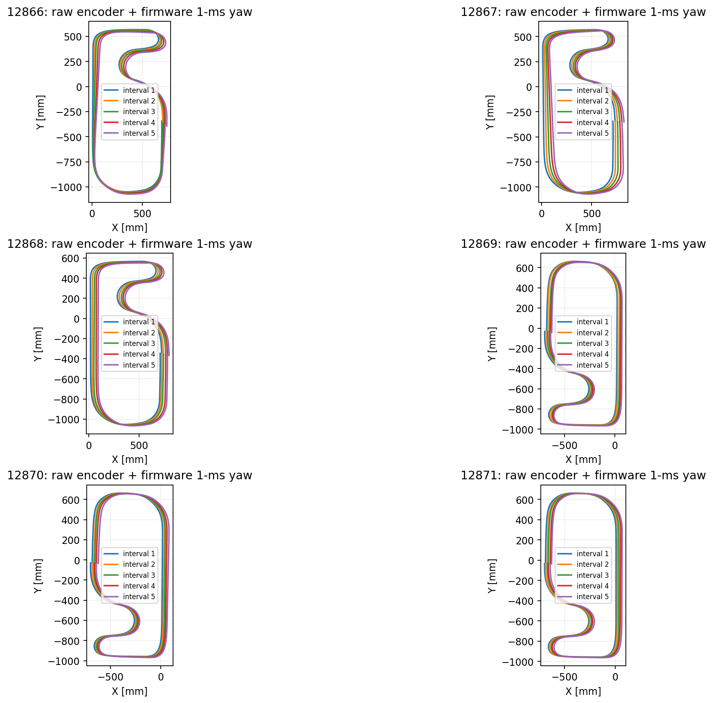
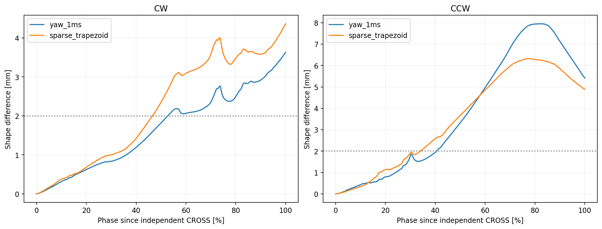
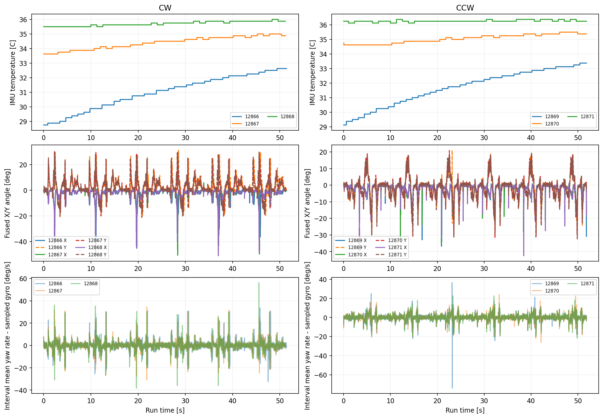

# IMU温度・XYZ角度を追加したログの検証 — 12866～12871

2026-10-03。CW12866～12868、CCW12869～12871。解析でファームウェアの変更・書き込みは行っていない。

## 新形式の実機ログ確認

追加6列 `imuTemp_C`, `gyroVal_X`, `gyroVal_Y`, `imuAngle_X`, `imuAngle_Y`, `imuAngle_Z` が全6ログで存在する。既存35列の後ろに追加され、通常41列（既存仕様の末尾空列は除く）。全行で見出しと列数が一致。最大データ行264バイト（CRLF含む）で1024バイトバッファに収まり、改行切り捨てや連結行なし。

期待行数一致、emcStop=0、optimalTrace=0、校正100回・エラー0、時刻と生距離単調、全使用列が有限値。目標29 pulse/ms（約0.5 m/s）、生距離/時間の平均実速度は約0.539～0.541 m/s。最大11 msのログ間隔は5 mmごとの記録に整合する。独立ラインCROSSは各6回。縦横slipFlagは全行0で、実スリップ不存在の証明ではない。

IMU温度は全行有効で-999なし。実測値は0.125°C格子に一致し、走行中に13～30回値が変化した。XYZ角度、XY角速度も有限値。Z角度はCWで約+2160°、CCWで約-2160°まで連続積算され、360°で折り返されていない。

## 1 ms積算Z角度で確認したXドリフト

**疎なログ角速度の再積分を避けても、X+方向のドリフトは残る。** CSV x/yだけの表示異常や、疎な角速度積分の誤差だけでは説明できない。

| 方向 | CSV X [mm/周] | 生距離＋1 ms Z角度 X [mm/周] | 生距離＋疎な台形gyro X [mm/周] | 1 ms Zの一周±360°との差 [deg/周] |
| --- | ---: | ---: | ---: | ---: |
| CW | +16.5 | +16.6 | +16.2 | +0.086 |
| CCW | +15.4 | +14.3 | +14.0 | +0.076 |

各方向3ログ、各ログCROSSから次のCROSSまでの5完全区間を平均。1 ms Z角度はCSVの `imuAngle_Z` の取得時点での値そのもの。ジャイロの測定誤差まで除いた正解角度ではない。

| ログ | 方向 | 生距離＋1 ms ZのX [mm/周] | Y [mm/周] | 一周角度差 [deg/周] | 電圧 [V] | 校正平均温度 → 記録終了温度 [°C] |
| --- | --- | ---: | ---: | ---: | ---: | --- |
| 12866 | CW | +10.1 | -9.7 | +0.598 | 8.30 | 28.400 → 32.625 |
| 12867 | CW | +21.9 | -1.4 | -0.438 | 8.23 | 33.719 → 34.875 |
| 12868 | CW | +17.8 | -4.2 | +0.099 | 8.19 | 35.669 → 35.875 |
| 12869 | CCW | +13.9 | -2.2 | +0.036 | 8.15 | 28.844 → 33.375 |
| 12870 | CCW | +15.4 | -0.9 | +0.170 | 8.10 | 34.719 → 35.375 |
| 12871 | CCW | +13.7 | -0.8 | +0.022 | 8.06 | 36.369 → 36.250 |

CCW12869/12871は一周角度差が約+0.036/+0.022°でも、Xは約+13.9/+13.7 mm/周移動している。一周総角度のずれが小さくても閉路位置のずれは残る。区間内の角度誤差分布・横速度欠落・距離の偏りなどは別途検証が必要。

前回12857～12862の生距離＋疎な台形gyroではCW+12.2、CCW+16.5 mm/周。今回同じ疎な方法ではCW+16.2、CCW+14.0。ログのばらつき、電圧、温度、方向反転時の条件差があるので、ログ列の追加による改善・悪化とは扱わない。

## 差が増える区間の再評価

各周の開始位置と開始推定向きをそろえ、最初の完全CROSS間区間と後続4区間を正規化距離1001点で比較。平均XY形状差が2 mmを超えて周回の2%以上続く最初の地点を検出点とする。CROSSを0%、次のCROSSを100%とする。この地点は絶対位置誤差や横滑りの発生開始点ではない。初周から毎周同じ誤差は形状比較だけでは見えない。

- CW: 1 ms Z角度では**52.7%**、同じログの疎な台形gyroでは46.6%。1 ms Zでの最大平均形状差は約3.63 mm、5 mmの持続検出なし。
- CCW: 1 ms Z角度では**40.6%**、疎な台形gyroでは34.1%。5 mm検出は60.2%、最大平均形状差は約7.95 mm。

同じデータでも積分方法だけで2 mm検出位置が約6ポイント動く。従来の疎なgyroによる検出位置は解析モデルに依存しており、今後の同一区間比較では記録済み1 ms Z角度を優先する。今回の検出位置も外部の絶対誤差開始点ではない。

一周あたりX+14～17 mmの平行移動があるのに形状差は3～8 mm程度という結果は矛盾ではない。形状差のグラフでは各周の開始位置・向きを取り除いており、毎周繰り返される平行移動の成分は取り除かれる。形状の再現性と絶対推定位置のドリフトを分けて扱う。

## 温度とXY姿勢角

12866の記録温度は28.75→32.625°C、12869は29.125→33.375°Cへ上昇。12868/12871では温度変化が小さいが、Xドリフトはそれぞれ+17.8/+13.7 mm/周残る。温度変化がある走行だけに発生する現象ではない。温度補正後の残留誤差がないことを示すものではない。

X融合姿勢角の最小値は-35.5～-51.2°、Yはおおむね-32.4～+31.1°の範囲まで変化し、コースに同期したピークが繰り返される。これは現行calcDegreesの加速度融合値であり、走行中の並進・旋回加速度を受ける。**そのまま実際の機体傾斜角とは見なさない。** 現行コードのX/Yは加速度由来角度をコンプリメンタリ係数で更新した値。これを用いた3D座標回転やgyro Zの傾斜補正を直ちに採用しない。

XY角速度のRMSはX約7.9～13.1 deg/s、Y約2.5～2.7 deg/s。瞬間的な角速度・振動も含む指標で、姿勢角ピークの原因をこのRMSだけでは同定できない。

下段はZ積算角度差から求めたログ間隔内平均角速度と、行に記録された終端gyroVal_Zの差。曲率変化・振動時に瞬間標本と間隔平均が異なるのは自然で、差だけをセンサー異常と判定しない。疎な台形gyroと記録済みZの走行終端角度差は-0.540～+0.658°で、ログ後の再積分精度にも限界がある。

## 再計算方法と限界

入力は左右生積算エンコーダ、cntlog、校正済み角速度、ライン値、追加IMU列。CSV x/yは診断比較としてのみ使い、生軌跡計算には使用しない。ROC・encTotalOptimal・経路生成値も使用しない。

ds=(ΔencTotalL+ΔencTotalR)/2/58.019 [mm]。方位h=imuAngle_Z [deg]をそのままラジアンへ変換し、隣接ログ間の平均方位で各dsをXYへ投影する。1 ms角度の終端値を使うためログgyroの疎な積分は不要。ただしログ間隔内の距離/角度の細かな時間関係までは記録されておらず、厳密な1 ms XY再現ではない。既存温度・方向補正を再適用しない。追加yI=0。

独立CROSSは全幅ライン反応と前回の素子幾何から車軸中点通過へ補正する。外部の正しいコース座標、車体横速度は記録されていないため、原因を確定してはいない。次の重点は各周で繰り返す平行移動成分であり、旋回前後の距離・方向・横加速度の整合を調べる。新しい補正値の採用やファームウェア変更は行っていない。

スクリプト: analysis/script/analyze_imu_angles_12866_12871.py。health.csvにSHA-256、列数・行数・最大行長、温度・角度範囲を保存。前回のanalyze_yi_12838_12848.pyとsensor_centers.csvを再利用。validation.jsonが初回実機ログの新列・保存形式の確認結果。
