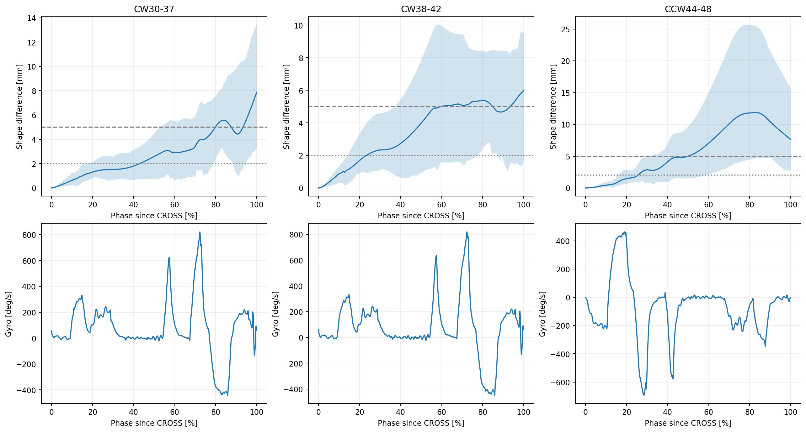
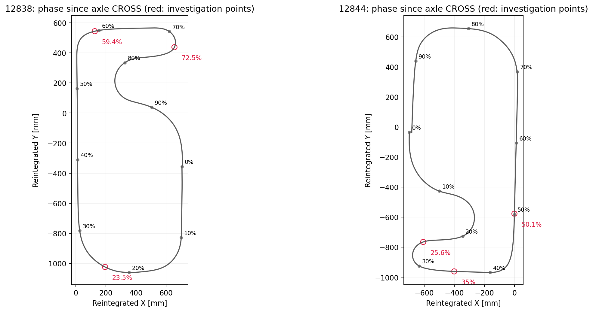
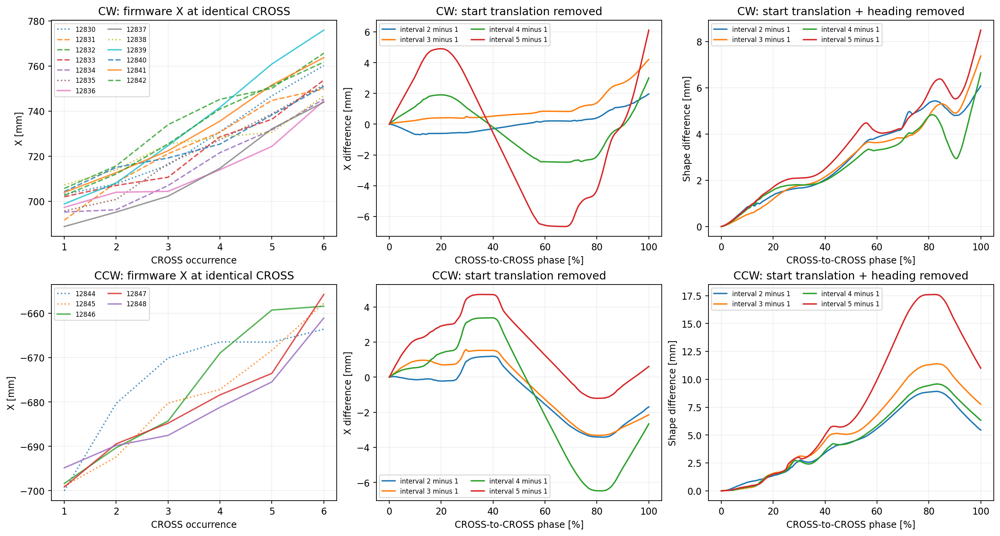
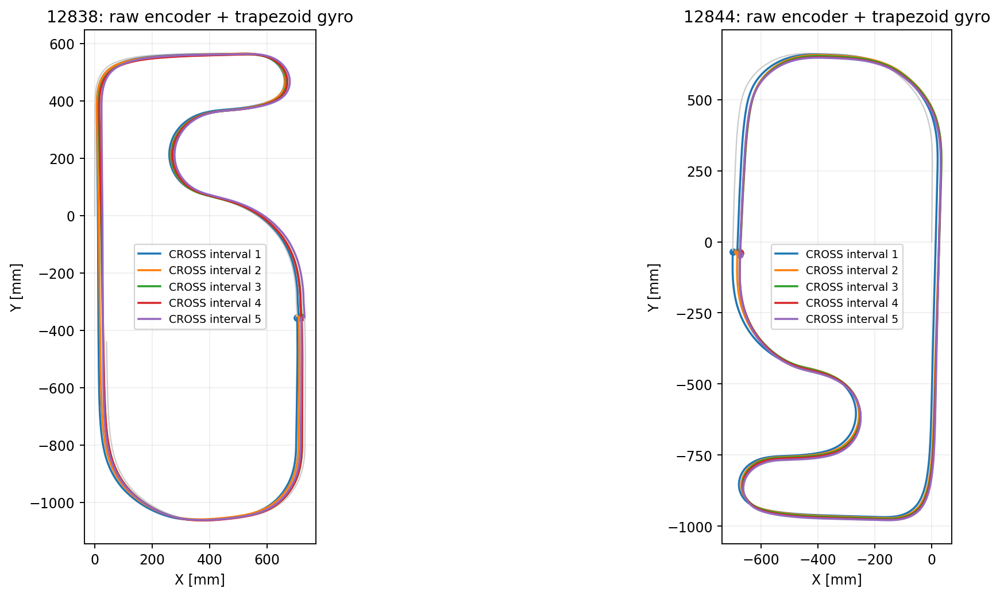

# 周回によるXドリフトの発生区間調査 — 12830～12848

2026-10-03。対象18ログ。12843.csvは存在しない。ファームウェア変更・書き込みは行っていない。

## 結果

同じCROSS地点の推定XはCW平均+11.0 mm/周、CCW平均+7.8 mm/周増加した。生の左右エンコーダ積算値と台形積分gyroによる再計算でもCW+9.1、CCW+5.8 mm/周となり、表示座標だけの異常ではない。ここでの「周」は同じCROSSから次のCROSSまで。

開始位置・開始推定角度を一致させた後、最初の完全CROSS間区間と後続4区間の軌跡形状差を比較した。平均差が2 mmを超え、その状態が周回の2%以上（約95 mm）続く最初の地点を検出点とした。**この2 mmは解析上のしきい値であり、実際の誤差がそこから発生したとの断定ではない。** 微小な差はそれ以前から存在する。

| ログ群 | CSVのX移動 [mm/周] | 生データ台形積分 [mm/周] | 形状差2 mm検出（CROSSから） | 形状差5 mm検出（CROSSから） |
| --- | ---: | ---: | --- | --- |
| CW30-37 | +10.9 | +9.1 | 42.9% / 2029 mm | 79.9% / 3778 mm |
| CW38-42 | +11.3 | +9.1 | 23.5% / 1111 mm | 59.4% / 2808 mm |
| CCW44-48 | +7.8 | +5.8 | 25.6% / 1215 mm | 50.1% / 2378 mm |

CW12830～12837と12838～12842では検出位置が異なるため、CW全体を平均した37.5%を共通の開始位置として採用しない。前者の電圧8.13→7.90 V、後者8.35→8.23 V。電圧の影響を同定したわけではない。CCWは8.17→8.06 V。

## 調査を優先する区間

12838～12842の形状差はCROSS後約1.1 m（23.5%）、最初の広いカーブ区間内ですでに2 mmを超える。CCWはCROSS後約1.2 m（25.6%）、最初の大きな正旋回から負の急旋回へ切り替わる区間で2 mmを超える。

変化の大きい区間として、CW70～75%（CROSS後約3.31～3.55 m）とCCW25～40%（約1.19～1.90 m）を優先する。CROSSを共通基準にCCWの進行順を反転すると、CW70～75%はCCW25～30%に概ね対応し、同じ急旋回付近になる。ただし周回距離・進行方向による検出点の差があるので、割合の反転だけで厳密な同一点とは扱わない。

5%区間ごとに、開始位置・向きをそろえた差ベクトルの変化量を計算した（phase_bins.csv）。CW70～75%は平均2.47 mmで最大、CCW35～40%は2.05 mm、30～35%は1.95 mm。CCWでは急旋回の後にも差が増え、60～85%の直線付近でも拡大する。この直線上の拡大は手前で生じた角度誤差の伝播でも起こるため、その場所で横滑りしたという証拠にはならない。

灰色の線と座標は生ログから再積分した推定値。実測コース図ではない。割合はCROSS通過を0%、次のCROSSを100%とする。赤丸は2/5 mm検出点と大きく変化する区間の代表点。CWの2/5 mm点は12838～12842群、CCWは12844～12848群の平均。

## 比較方法と意味

- ユーザーの6周走行のうち、CROSS6回で直接切り出せる完全な区間は5周分。開始前側約2.54 m（CW）/1.80 m（CCW）と終了側約1.77 m/2.52 mは全軌跡図に表示するが、完全周回との形状差計算に混ぜない。
- CROSSはcourseMarker=3の立ち上がりを確認し、独立に検出したライン全幅反応と前回の素子位置から車軸中点通過へ補正。前回の解析スクリプトのanchor/axleanchorsとsensor_centers.csvを再利用した。
- 基準の距離は `(ΔencTotalL+ΔencTotalR)/2/58.019` [mm]。x/yは生データ再計算に使用せず、CSV座標の診断として別に比較した。外部座標の正解としては使っていない。
- gyroは校正済みgyroVal_Z。スケール係数-0.9924を再適用しない。追加yI補正0。台形積分角度と中点方位で変位を積分した。
- 同一ログ内で最初の完全CROSS間区間を基準に後続4区間を比較。1001点の正規化距離で対応付け、開始位置を引き、開始角度だけを取り除く。軌跡全体の最小二乗位置合わせは行わない。基準区間自体の誤差は未知であり、毎周同じ誤差を完全に同定することはできない。
- グラフの形状差はX差だけではなくXY差の大きさ。開始角度をそろえた座標系なので、形状差のXをそのままスタート原点のX方向とは扱わない。
- 同じログの周回や同じ基準区間を共有する比較は独立試行ではない。帯は分布の10～90%であり、信頼区間ではない。

左は座標の平行移動を残した同一CROSS地点のX。中は各区間の開始位置だけをそろえたX差。右はさらに開始推定角度をそろえたXY形状差。左に残る平行移動と右の形状差は別の量。

## 感度と確認

右端gyro積分/台形積分、既存の左右エンコーダ相対補正あり/なし、正規化距離/等距離対応で再確認（onset_sensitivity.csv）。2 mm検出位置はCW30～37で41.1～43.4%、CW38～42で22.4～24.0%、CCW44～48で25.5～25.6%。5 mm検出はそれぞれ79.9～82.9%、56.3～59.5%、49.8～50.1%。群間差のほうが手法による差より大きい。

全18ログでemcStop=0、期待行数一致、時刻/生距離単調、最大ログ間隔6 ms、CROSS6回、IMU校正有効。縦横slipFlagはすべて0で、実スリップ不存在の証明ではない。ログSHA-256をhealth.csvに保存。

CSV x/yは現行SDcard.c/endLog→courseAnalysis.c/calcXYcieの式（整数encCurrentCorr_p×dt、右端gyro×dt、更新後角度）を再現し、最大差0.089 mmだった。float32の逐次丸めとCSV丸めを含むため厳密な同一ビット比較ではない。生積算エンコーダ＋台形gyroとの周回X差は平均約2～3 mm/周。ログ標本からの再計算なので、その差をそのまま実機の誤差修正量と断定しない。

積算角度の一周±360°からの平均差はCW-0.174°/周、CCW-0.030°/周。方位誤差だけで平行移動がどの区間に発生したかは一意に決まらない。加速度・エンコーダ左右差・角速度の詳細因果診断は次段階とする。

## 現時点の限界と次の調査

今回特定したのは**周回ごとの推定形状の差が検出可能になる区間と、差が大きく変化する区間**。外部の正しいコース座標・横速度は記録されていないため、初周から毎周同じだけ生じる絶対位置誤差の開始点や、横滑りの発生点を一意に確定することはできない。実走行は同じコースをたどっているというユーザー確認を前提にした推定不整合の調査である。

次は最初の広いカーブと上記急旋回区間について、左右エンコーダ差・gyro積算角度・補正済み加速度・推定横加速度の整合を比較し、並進横速度の欠落、角度誤差、ログ再積分の差を区別する。現在は補正値の採用もファームウェア変更も行っていない。

実行: `python analysis/script/analyze_lap_drift_12830_12848.py`。前回コミット内のanalyze_yi_12838_12848.pyとanalysis/yi_12838_12848/sensor_centers.csvが必要。追加のビルドはファームウェア未変更のため実施していない。
