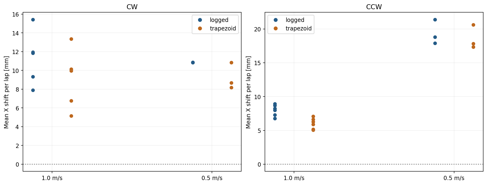
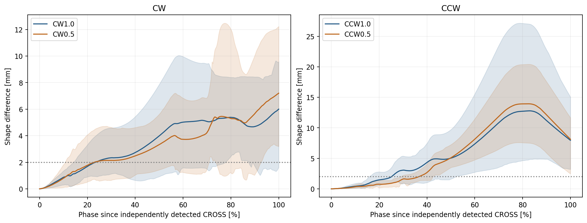
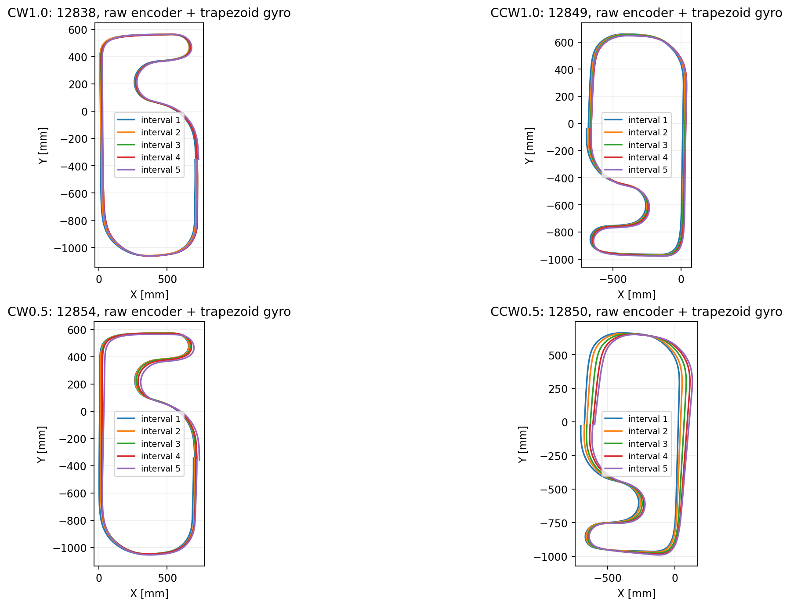

# 0.5 m/s走行と周回ドリフトの比較 — 12849～12856

2026-10-03。新規ログ7本を確認し、前回ログ10本と比較。ファームウェア変更・書き込みは行っていない。

## 条件の確認

- 12849～12852はCCW。12854～12856はCWで、gyro積算角度の符号とも一致。
- **12849はtargetSpeed=58 pulse/ms（約1.0 m/s）のまま**。0.5 m/s群には入れない。12850～12852、12854～12856はtargetSpeed=29（約0.5 m/s）。
- 12853.csvはF:/Dropbox/Document/robotrace/Log内に見つからないため未解析。欠番理由は不明。
- 実際の生エンコーダ距離/時間による平均速度は、0.5設定で0.533～0.541 m/s、1.0設定で約1.02～1.03 m/s。距離換算は58.019 pulse/mm。
- 新規の電圧は7.97→7.73 V。比較基準のCWは8.35～8.23 V、CCWは8.17～8.06 V（追加12849は7.97 V）。速度だけが異なる対照実験ではない。速度による因果や補正値採用の確定には、充電して同じ電圧帯での再走行が必要。

## 結果

**0.5 m/sへ下げてもX+方向のずれは解消せず、CWはほぼ同程度、CCWは増加した。** CSV x/yの表示上の問題だけではなく、生左右エンコーダ積算値とgyroから再積分しても残る。

| 方向・設定速度 | ログ数 | CSV座標のX移動 [mm/周] | 生データ台形積分 [mm/周] | 周回間形状差2 mmの検出位置 |
| --- | ---: | ---: | ---: | ---: |
| CW1.0 | 5 | +11.3 | +9.1 | 23.5% |
| CW0.5 | 3 | +10.8 | +9.2 | 22.9% |
| CCW1.0 | 6 | +8.0 | +6.0 | 25.2% |
| CCW0.5 | 3 | +19.4 | +18.6 | 36.7% |

1.0群: CW12838～12842、CCW12844～12849。前回CCW12844～12848だけの平均はCSV+7.8、生積分+5.8 mm/周で、12849を追加すると+8.0、+6.0。

「周」は独立に検出した同じCROSSから次のCROSSまで。各ログ5つの完全周回区間を使用。形状差の検出位置は各周の開始位置と開始推定角度をそろえ、最初の完全区間と後続4区間のXY差の大きさを平均したもの。平均差が2 mmを超えて2%以上の距離にわたり続く最初の点。CROSS通過を0%、次のCROSSを100%とする。**絶対位置誤差や横滑りがそこから始まったという意味ではない。** 毎周同じ誤差はこの形状比較だけでは見えない。

点は1ログ内5区間の平均。各周と同じ基準区間を共有する比較は独立試行ではない。

## 新規ログの個別値

| ログ | 方向・設定 | 生距離/時間の速度 [m/s] | 電圧 [V] | CSV X [mm/周] | 生積分 X [mm/周] | 一周±360°との差 [deg/周] | courseMarker/独立検出CROSS数 |
| --- | --- | ---: | ---: | ---: | ---: | ---: | --- |
| 12849 | CCW1.0 | 1.025 | 7.97 | +8.9 | +7.1 | +0.085 | 6/6 |
| 12850 | CCW0.5 | 0.533 | 7.92 | +21.4 | +20.6 | +0.989 | 6/6 |
| 12851 | CCW0.5 | 0.538 | 7.87 | +17.9 | +17.8 | +0.923 | 6/6 |
| 12852 | CCW0.5 | 0.538 | 7.83 | +18.8 | +17.3 | -0.115 | 6/6 |
| 12854 | CW0.5 | 0.540 | 7.79 | +10.9 | +8.7 | +0.088 | 3/6 |
| 12855 | CW0.5 | 0.541 | 7.76 | +10.8 | +10.8 | +0.552 | 5/6 |
| 12856 | CW0.5 | 0.541 | 7.73 | +10.8 | +8.2 | +0.013 | 4/6 |

12850/12851では一周角度差が約+1°だが、12852では約-0.115°でもX+17.3 mm/周のずれが残る。CCW低速のずれを一周総角度の差だけで説明できたとは言えない。途中の角度誤差分布も必要。

## 差が増える区間

CWの2 mm検出位置は1.0設定23.5%、0.5設定22.9%とほぼ同じ。0.5群の平均一周距離を基準にするとCROSS後約1.08 mで、最初の広いカーブ区間。5 mm検出は59.4%→72.1%となり、中盤の形状差は多少小さいが、最終的なXドリフトは減っていない。

CCWの2 mm検出位置は25.2%→36.7%へ後ろに移った（0.5群の距離で約1.74 m）。前回の急旋回付近での形状差は低速で小さくなるが、その後に増加し、5 mm検出位置は49.8%→49.7%とほぼ同じ。60～85%では低速でも差が増える。この直線側での拡大は前の区間の角度誤差の伝播でも起こるので、その場所で滑ったとの断定はしない。

帯は周回比較の10～90%分布で、信頼区間ではない。

## CROSS不足とログ健全性

12854/12855/12856のcourseMarker=3立ち上がりは3/5/4回。一方、ラインセンサー8ch以上の全幅反応は全ログ6回あり、通常の1～2chのライン追従と分離できた。GPIOやCROSS確定の挙動差か、短いイベントのログ標本化かは未確定。記録されていないcourseMarkerイベントをあったことにして補完していない。

今回はcourseMarkerを周回の境界に使わず、独立したライン全幅反応と外側8chの個別進入/退出から車軸中点の通過位置を推定した。前回のsensor_centers.csvと同じ幾何補正。低速時の光学応答が同一という仮定は残る。

全17ログで期待行数一致、emcStop=0、IMU校正有効、距離換算検証有効、時刻/生距離単調、値有限。行間距離平均約5 mm。1.0設定最大6 ms、0.5設定最大11 msは速度と距離基準ログに整合し、時間差だけで欠落とは判定しない。縦横slipFlagは全行0で、物理的な滑り不存在の証明ではない。

## 解釈と次の調査

速度を下げたとき、CROSS直後からの周回間形状差が一部小さくなる効果はあるが、Xドリフトは残り、CCWでは増えた。したがって「速度依存の横滑りが主因で、低速化すれば解消する」という説明は今回の結果では支持されない。固定車輪の旋回に伴う横方向変位の欠落、gyro残留オフセット/温度、時間に依存する積分誤差などを分けて調べる必要がある。これらは仮説であり、原因を確定してはいない。

今回のraw台形積分では、時間増加に伴う一周角度の偏りもあるが、12852の例のように一周総角度だけでは説明できない。次は同一コース区間のgyro角度差、左右エンコーダ差、補正済み加速度を速度別に比較する。補正値やgyro係数は採用していない。

解析スクリプト: analysis/script/compare_lap_drift_12849_12856.py。入力CSVのSHA-256はhealth.csvに保存。前回のanalyze_yi_12838_12848.pyとsensor_centers.csvを再利用する。生積分ではCSV x/y、ROC、encTotalOptimalを使わず、x/yは別の診断指標として扱う。gyroScaleCoeffを二重適用しない。yI=0で比較。右端積分でも低速CCW+19.4、CW+10.3 mm/周で結論は同じ。
