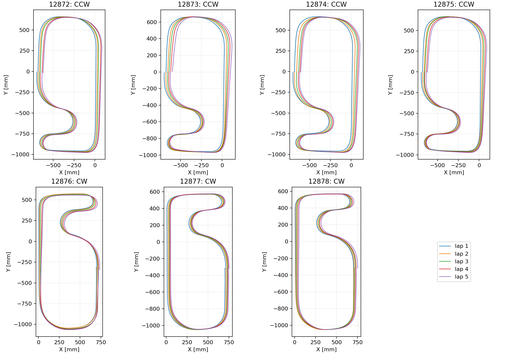
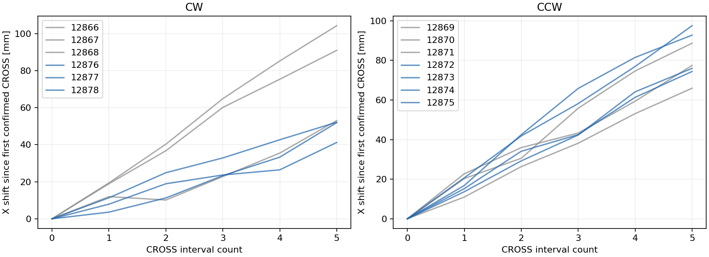
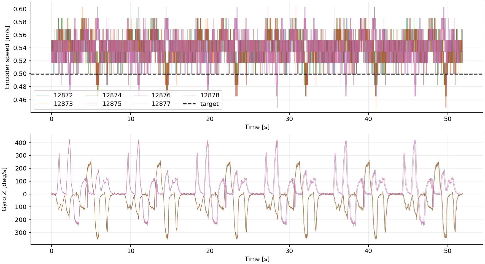

# 最小ログ12872～12878の検証

12872～12875 CCW、12876～12878 CW。ファームウェア変更・書き込みは実施していない。

## 記録形式と健全性

全7本が通常13列（末尾空列を除く）。最大データ行80バイト。期待行数一致、正常終了emcStop=0、一次走行optimalTrace=0、校正100サンプル・読取エラー0、距離換算検証成功。時刻・距離は単調、最大ログ間隔11 msで5 mm距離記録に整合。全使用値は有限値。CROSS確定は各6回、slipFlag/slipFlagLatは全行0。フラグ0は実スリップがない証拠ではない。

目標29 pulse/ms = 0.4998 m/s、CROSS区間の距離/時間で約0.538～0.540 m/s。速度追従RMSEは約0.043～0.044 m/s。

## 周回ドリフト

各ログの6回のCROSS確定先頭行を境界に、5個の完全CROSS間区間を比較。CSV x/yを評価する。独立ラインCROSSや実位置を使った解析ではない。前回12866～12871も同じCROSS確定・CSV x/y方式で再計算した。

| ログ | 方向 | X [mm/周] | Y [mm/周] | 区間時間 [s/周] |
| --- | --- | ---: | ---: | ---: |
| 12872 | CCW | +15.2 | -1.3 | 8.777 |
| 12873 | CCW | +19.5 | +3.5 | 8.775 |
| 12874 | CCW | +18.5 | +0.8 | 8.764 |
| 12875 | CCW | +14.9 | +0.7 | 8.776 |
| 12876 | CW | +8.2 | -6.0 | 8.724 |
| 12877 | CW | +10.4 | +0.0 | 8.700 |
| 12878 | CW | +10.4 | -0.6 | 8.707 |

同じ比較方法で、CWは前回+16.6 → 今回+9.7 mm/周（約41%減）、CCWは+15.5 → +17.0 mm/周。CWは全3本で+8.2～+10.4 mm/周へ減った。CCWは+14.9～+19.5 mm/周で残る。前回の生距離＋1 ms積算Z角度の値とは解析方法が異なるため直接混ぜない。

CW区間時間は8.677 → 8.710 s、CCWは8.773 → 8.773 s。ログ縮小でラップタイムが改善した結果ではない。

## 結論と限界

X+ドリフトはログを22バイトへ減らしても残る。CWでは今回小さいが、CCWは減っていないため、ログ負荷だけを原因とすることはできない。方向切替、温度、電圧、走行間ばらつきは交絡する。CCWの前回電圧8.15～8.06 Vに対し今回8.03～7.88 V、CWは前回8.30～8.19 Vに対し今回8.26～8.15 V。温度はメタデータの校正・終了値だけで、走行中の温度系列はない。

新ログは左右累積エンコーダ、ラインセンサー、imuAngle_Zを含まない。独立全幅ラインによるアンカー補正、生距離での独立再積分、記録済み1 ms角度での比較を実施できない。CROSS確定時刻の揺れも含まれるため、今回の数値から横滑りの開始地点や物理原因を断定しない。

閉路検証は12876のみ有効（goalMarkerX=42.56 mm）。他6本はclosureReason=8、ゴールマーカー位置Xが67.13～80.33 mm（CCW）または63.50～65.86 mm（CW）で±60 mm条件を超える。正常終了していても、これら6本は現行PATH/SHORTCUTの経路元として無効。ゴールマーカーXと停止時の最終Xは異なる。

再現: `python analysis/script/analyze_minimal_12872_12878.py`。health.csvにSHA256、列数、行数、電圧・温度、校正、閉路検証を保存。lap_intervals.csvに全区間、per_log.csvとgroup_comparison.csvに集計を保存。
