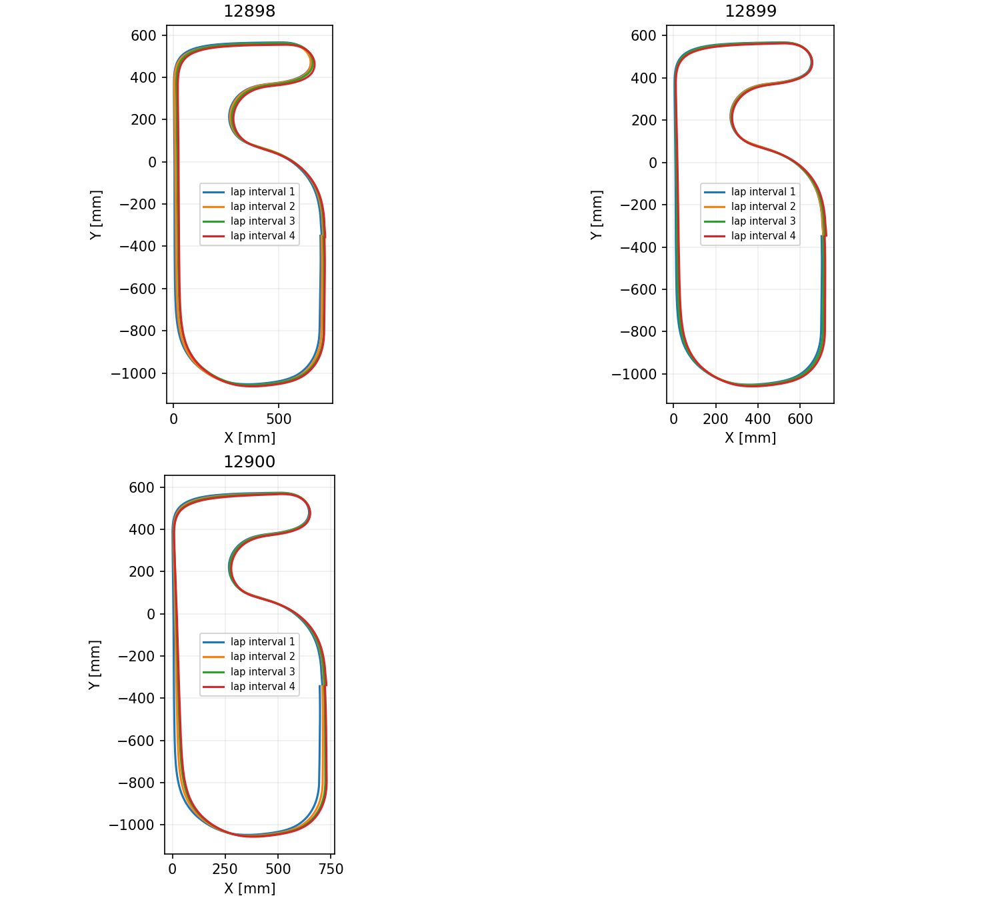

# 12898～12900の周回ずれ

3本ともCW、目標0.5 m/sの一次走行、正常終了。前回6回のCROSS通過から今回5回に変わり、今回は4つの完全な周回区間を評価した。CSV行数4585/4584/4585は期待行数と一致。buildTimeは22:13:55、ジャイロ倍率−0.992400、温度補正係数0.007955 deg/s/°Cは前回と同じ。

|ログ|実速度平均[m/s]|Xずれ[mm/周]|Yずれ[mm/周]|閉路残差平均[mm]|IMUとラインの旋回角差[deg/周]|
|---|---:|---:|---:|---:|---:|
|12898|0.526|+5.68|−3.39|7.34|+0.106|
|12899|0.527|+5.66|−1.03|6.07|−0.248|
|12900|0.528|+8.01|−0.64|8.09|−0.229|

今回の平均Xずれは+6.45 mm/周。4区間すべてが各ログでX+方向。前回12895～12897は−3.26 mm/周だったが、実速度も0.406～0.420 m/sから0.526～0.528 m/sに変わっている。バッテリーは8.09～8.16 V、前回8.20～8.32 V。ユーザー回答により、駆動ホイール変更とギアのバックラッシを0.1増やしたことを確認（0.1の単位は回答に記載なし）。回転が滑らかになったという実機観察と速度増加は整合するが、速度増加の原因をログだけで確定しない。ソフトウェアビルド時刻も異なる。同条件で改善・悪化したとは断定しない。

以前の約0.54 m/s走行12885～12888・12890ではX+7.79 mm/周で、今回も同じ方向・同程度。速度とXずれの関係は候補だが、過去と今回の電圧・ビルド・走行条件も異なるため因果関係は未確定。

## IMUとログの健全性

IMU校正成功、読出しエラー0、温度異常行0。加速度Z平均0.997～1.003 g。校正時の通信エラー0は、走行中のSPI通信エラー0を保証しない。

cntlogは今回43.440～43.601秒で終了し折り返しなし。距離間隔4.46～5.55 mm、時刻は単調増加、必要値は全て有限、原本SHA256不変。distanceScaleVerified=1、closureValid=1、closureReason=0。時刻処理はユーザー指定により変更していない。

独立したラインCROSSの同じ通過位置で周回差を評価。保存済みimuAngle_Zの中点方位と左右累積エンコーダ平均距離でXYを再構成し、疎な角速度を再積分していない。CROSS姿勢変化を差し引いた旋回角差の符号はログ間で揃わず、一様なジャイロ角度倍率誤差だけで共通のX+ずれを説明できる証拠は得られていない。左右平均累積距離とencTotalOptimalの相対差は3本とも±0.5 pulse以内で、端数処理と整合。縦・横スリップ判定フラグは全行0だが、実際の滑りがない証明にはならない。

駆動ホイール変更後の実効距離換算は独立した実距離測定で未検証。distanceScaleVerified=1はログ内の距離積算整合を確認したものであり、タイヤ径や実距離の正確さを新たに検証したものではない。

実位置の正解測定がないため、局所的な方位誤差と距離誤差は引き続き分離が必要。

再実行: `python analysis/script/check_imu_init_runs_12895_12897.py --new-logs 12898 12899 12900 --output analysis/runs_12898_12900`。詳細はper_log.csv、lap_intervals.csv、validation.json、courses.png。

