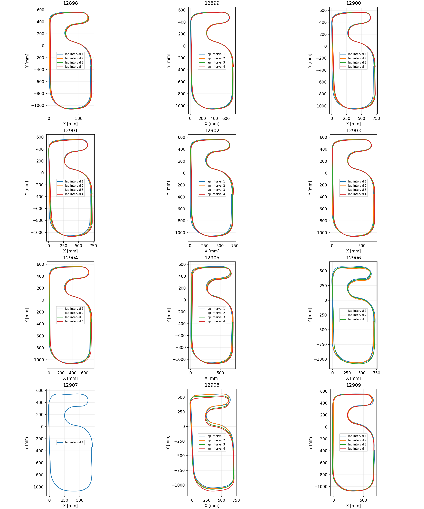

# 12901～12909の走行確認

9本ともCW、正常終了、期待行数一致、IMU校正100サンプル・読出しエラー0、温度異常行0。全てbuildTime=22:13:55で前回12898～12900と同じ。ジャイロ倍率−0.992400、温度係数0.007955も同じ。バッテリーは8.06→7.81 V。全ログが65.536秒未満で終了し、時刻折り返しなし。ファームウェアは変更していない。

## 走行方式ごとの結果

|ログ|方式|実速度平均[m/s]|Xずれ[mm/周]|Yずれ[mm/周]|閉路残差[mm/周]|比較できた周回数|
|---|---|---:|---:|---:|---:|---:|
|12901|一次|1.015|+8.07|-0.09|8.10|4|
|12902|一次|1.016|+9.43|-0.77|9.82|4|
|12903|一次|1.016|+6.05|-1.32|6.21|4|
|12904|一次|1.016|+7.06|-2.36|7.88|4|
|12905|一次|1.020|+5.65|-6.29|9.03|4|
|12906|PATH REPLAY|1.018|+3.08|-1.30|8.09|4|
|12907|PATH REPLAY|1.019|+20.68|+4.40|21.15|1|
|12908|距離基準|1.681|-1.90|-17.26|20.58|4|
|12909|距離基準|1.556|-3.38|-0.90|8.18|4|

一次走行12901～12905は目標1.0 m/s、実速度1.015～1.020 m/s。X平均+7.25 mm/周。前回12898～12900の目標0.5 m/s・実速度約0.527 m/s・X平均+6.45 mm/周に対し、速度を上げてもX+方向の推定ずれが残る。速度倍増で位置ずれが単純に倍増する結果ではない。追加の実機・設定変更がないことは未確認。

PATH REPLAY12906・12907は目標1.0 m/s、経路元12905。12906は有効CROSS4回で計4周を評価し、途中の不採用CROSSを挟む2周区間は周回数で正規化した。12907は有効CROSSが2回しかなく、+20.68 mmはその間の1周だけの結果。全周平均として比較しない。CROSSの認識は5回とも存在するが、光学素子の幅・閾値条件を満たす素子が6個に足りない通過を除外した。判定閾値を緩めて精度不足を隠していない。

距離基準12908・12909は可変目標速度で、速度範囲・追従挙動が一次と異なる。12908ではX−1.90/Y−17.26 mm/周、12909ではX−3.38/Y−0.90 mm/周。12908のY方向のずれが大きく、2本の再現性も揃わない。ログ内の縦スリップ判定は238/198行、横スリップ判定は78/8行。フラグの有無は実際のスリップの独立証明ではない。

## 方位と位置の確認

位置は左右累積エンコーダ平均と保存済みimuAngle_Zの中点方位から再構成。走行方式間で同じ再構成を使い、疎な角速度の再積分をしない。PATHのログ座標や追従性能そのものを、この表だけで合格と判定しない。比較したのは推定軌跡の同一CROSS通過位置の差であり、実位置の正解は未測定。

一次走行のIMUと独立ライン姿勢を比較した周回旋回角残差は、12901～12905の順に−0.592/−0.440/−0.253/−0.283/+0.037 deg/周。4本では旋回角不足の方向だが、12905もX+ずれが残る。一定の倍率や温度補正をこの値だけで調整する根拠には不足する。

一次ログは全てclosureValid=1、distanceScaleVerified=1、closureReason=0。二次走行closureReason=1は一次経路元検証の対象外を示し、緊急停止の理由ではない。ログ欠落は距離基準で確認。一次の左右平均距離間隔は4.00～6.02 mm、速い距離基準走行は約2.53～7.41 mmと変動するため、一律7 mmの診断閾値を二次走行へ流用しない。

入力SHA256は解析前後不変。解析スクリプトは有効CROSS不足をイベント単位で記録し、複数周を跨ぐ区間を1周と数えない。詳細はanchor_rejections.csv、lap_intervals.csv、per_log.csv、validation.json、courses.png。

再実行: `python analysis/script/check_imu_init_runs_12895_12897.py --new-logs 12898 12899 12900 12901 12902 12903 12904 12905 12906 12907 12908 12909 --output analysis/runs_12901_12909`。

