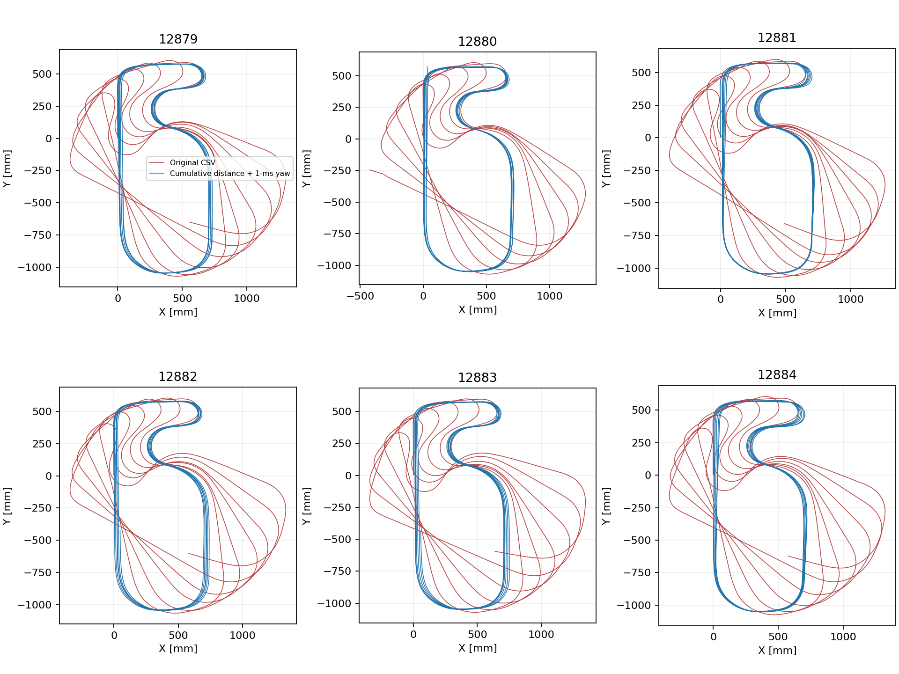

# 12879～12884のコースプロット崩れ

CSV座標の大きな崩れは、保存後のXY生成で疎な瞬時角速度を再積分する処理に起因する。1 ms周期で積算したimuAngle_Zと比べ、疎な角速度積分は走行全体で約66～79°小さい。直前12866～12871の差は概ね1°以内だった。

左右累積エンコーダは走行中に原点へ戻っていない。大きな負のジャンプは見つからず、左右平均距離とencTotalOptimalも整合している。12880の片輪小負増分は反転の範囲で、原点リセットの形ではない。現在のcontrol.cではユーザーがリセット処理をコメントアウトしており、この状態は変更していない。

## 同じログの再計算

累積距離encTotalOptimalの差分と、imuAngle_Zの区間両端平均を使って再計算した。元のCSVファイルは変更していない。

| ログ | 疎な角速度積分とZ積算角度の終了差 [deg] | 再計算X [mm/周] | 元のゴール位置X [mm] | 再計算ゴール位置X [mm] |
| --- | ---: | ---: | ---: | ---: |
| 12879 | -74.1 | +5.6 | +623.3 | +39.9 |
| 12880 | -65.6 | +5.7 | -351.0 | +39.1 |
| 12881 | -71.0 | +3.0 | +556.1 | +26.0 |
| 12882 | -73.0 | +7.8 | +649.6 | +49.1 |
| 12883 | -78.5 | +8.4 | +703.7 | +58.6 |
| 12884 | -76.0 | +5.1 | +643.2 | +25.1 |

周回はcourseMarkerのCROSS確定先頭行間。12880はCROSS5回・Z終端約1793°で、他の6周相当ログより短く、同条件の6周評価には混ぜない。正常終了emcStop=0だけでは同一周回数を保証しない。

再計算では周回ごとの大きな回転・変形が消え、X+3～8 mm/周程度の小さな残差が残る。これは外部の正解位置ではなく、記録された1 ms姿勢を用いた推定結果。

疎な記録の角速度積分が突然偏った背景（周期振動とのサンプリング位相、処理負荷など）は未確定。エンコーダ累積値のリセットが原因と断定できる証拠はない。ログ形式の変更前後に1 ms角度と疎な積分の整合を確認する必要がある。

## ファームウェア修正

SDcard.cの保存後XY生成とゴールマーカー閉路検証の両方で、累積距離と1 ms積算角度を使用するよう変更した。calcXYcieの既存関数を変更し、距離と角速度のホールドによる再積分を除いた。ログ列・レコードサイズ・制御中の自己位置更新・エンコーダ取得は変更していない。

既存ログのclosureValid/closureReasonは元の判定なので、再計算結果だけで既存ログを実機PATH経路元として有効化しない。修正後の実機ログでCSV軌跡とゴール位置、閉路判定を確認する。

再現: `python analysis/script/recover_xy_12879_12884.py`。summary.csvと各番号のrecovered_xy.csvを保存。元の疎な積分を再現してCSV座標に一致することも検査する。
